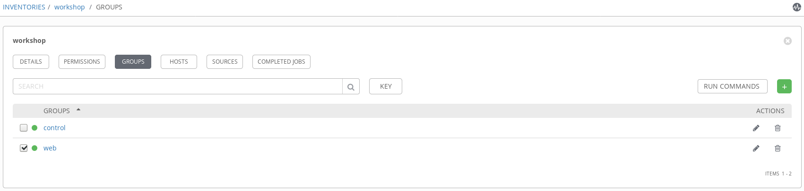

# Exercise 4 - Running Ad-hoc jobs

In this exercise, we are going to run Ad-hoc jobs from Ansible Tower. Ad-hoc jobs allow us to quickly and easily run commands against managed servers without having to write a playbook.

### Step 1:

In Tower, click on Inventories and then click on your "Ansible Workshop Inventory". Click the "Groups" button and tick the web group. 

The "run command" button is now enabled. Click the "run command" button. Let's run "df -h" on our web servers.

MODULE | command
-----|--------------------------------------
ARGUMENTS|df -h
LIMIT|web
MACHINE CREDENTIAL|Ansible Workshop Credential

### Step 2:

We can pass options to adhoc commands in Tower in the same way we would from the command line. Let's use the service module this time and restart httpd on our web servers.

Navigate to our web group again. In Tower, click on Inventories and then click on your "Ansible Workshop Inventory". Click the "Groups" button and tick the web group.

Click the "run command" button and enter the following values and then "Launch" the job.

MODULE | service
-----|--------------------------------------
ARGUMENTS|name=httpd state=restarted
LIMIT|web
MACHINE CREDENTIAL|Ansible Workshop Credential
ENABLE PRIVILEGE ESCALATION| [x] 

### Summary

We can run Ad-hoc jobs from Ansible Tower while still maintaining all of the same controls and auditing that we have with playbook runs.

---

[Click Here to return to the Ansible Lightbulb - Ansible Tower Workshop](../README.md)
