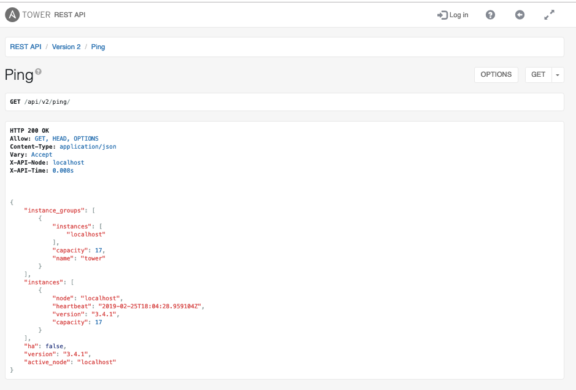

# Exercise 6 - Tower API

Ansible Tower has a RESTFUL API, which we'll explore a little here.

There are 2 versions, v2 being the current one.

## First API Call:

## Calling the API to check status:

## End Result
We've explored the Tower API.

---

[Click Here to return to the Ansible Lightbulb - Ansible Tower Workshop](../README.md)
