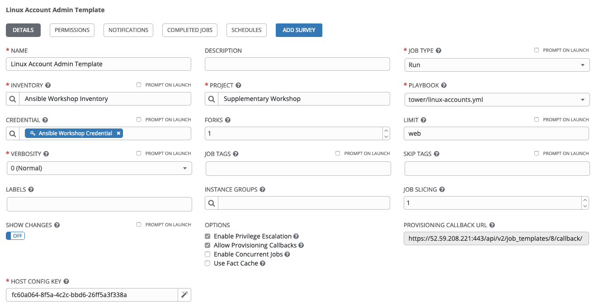

# Exercise 8 - Tower Provisioning Callbacks

Provisioning callbacks allow a host to initiate a playbook run against itself. The Job Template launched only runs against the host requesting the provisioning and the host must already be known to Tower and exist in the inventory.

Callback provides the ability to automatically configure a system after it has been provisioned by another system (such as AWS auto-scaling, kickstart etc) or for launching a job programmatically without invoking the Tower API directly. 

## Setting Up The Job Template:

We'll use the previous examples template. Although it'll do nothing, it'll prove functionality and boilerplates for any further modifications you may care to make.

### Step 1:

Select TEMPLATES

### Step 2:

Click on Linux Account Admin Template

### Step 3:

Remove the prompt on launch options previously set.
Add Allow Provisioning Callbacks

NAME |Linux Account Admin Template
-----|-------------------------
PROMPT ON LAUNCH|- [] Job Tags
PROMPT ON LAUNCH|- [] Extra Variables
Allow Provisioning Callbacks|- [x] 

This is enable the Callback URL. 

Now click on the  symbol to create a unique host key which will form the other part of the URL

* Tip: If you click on the ? mark associated with the Host Config Key you can see the full URL *

## Job Launch Settings:

## Launching The Job:

## Checking The Job

From the above output, I can see that "job": 6 so that's what I should look for in Tower under Jobs.

## End Result
We've explored the Tower API *Job Launch* facility in order to run a job template.

---

[Click Here to return to the Ansible Lightbulb - Ansible Tower Workshop](../README.md)
