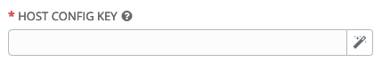

# Exercise 9 - Tower Provisioning Callbacks

Provisioning callbacks allow a host to initiate a playbook run against itself. The Job Template launched only runs against the host requesting the provisioning and the host must already be known to Tower and exist in the inventory.

Callback provides the ability to automatically configure a system after it has been provisioned by another system (such as AWS auto-scaling, kickstart etc) or for launching a job programmatically without invoking the Tower API directly. 

We'll use a combination of Tower and systemd service to create a host callback.

## Setting Up The Job Template:

We'll use the previous examples template. Although it'll do nothing, it'll prove functionality and boilerplates for any further modifications you may care to make.

### Step 1:

Select TEMPLATES

### Step 2:

Click on Linux Account Admin Template

### Step 3:

Remove the prompt on launch options previously set.
Add Allow Provisioning Callbacks

NAME |Linux Account Admin Template
PROMPT ON LAUNCH|- [] Job Tags
PROMPT ON LAUNCH|- [] Extra Variables
Allow Provisioning Callbacks|- [x] 

This will enable the Callback URL. 


Now click on the magic wand symbol to create a unique host key which will form the other part of the URL


* Tip: If you click on the ? mark associated with the Host Config Key you can see the full URL *

### Step 4:

Click on SAVE.

## Creating a systemd Service

Now we've done the Tower config work, we must create something to call it. For this, we'll create a simple systemd service on one of our web hosts. This will be invoked just once (on reboot) to emulate a freshly installed server which then needs further configuration/orchestrating.

### Step 1: Login to node3

Login to node3 (check the inventory file for details remember)

We need to be root

```bash
sudo -i
```

### Step 2: Create the ansible-callback systemd service

```bash
vi /etc/systemd/system/ansible-callback.service
```

Add the following lines. Note you need to change the host_config_key data, Public IP and job template number, to match your Job Template details.

```bash
[Unit]
Description=Provisioning callback to Ansible Tower
Wants=network-online.target
After=network-online.target

[Service]
Type=oneshot
ExecStart=/usr/bin/curl  -k -s --data "host_config_key=fc60a064-8f5a-4c2c-bbd6-26ff5a3f338a" https://52.59.208.221/api/v2/job_templates/8/callback/
ExecStartPost=/usr/bin/systemctl disable ansible-callback

[Install]
WantedBy=multi-user.target
```

### Step 3: Enable the systemd service

```bash
systemctl daemon-reload
systemctl enable ansible-callback
Created symlink from /etc/systemd/system/multi-user.target.wants/ansible-callback.service to /etc/systemd/system/ansible-callback.service.
```

## Testing the Callback:

Reboot the node:

```bash
shutdown -r now
```

Wait for it to come back up and login again.

## Checking The Job

Check that the service was invoked using

```bash
sudo journalctl -b -u ansible-callback
-- Logs begin at Tue 2019-02-26 10:17:18 UTC, end at Tue 2019-02-26 10:21:02 UTC. --
Feb 26 10:17:24 node3 systemd[1]: Starting Provisioning callback to Ansible Tower...
Feb 26 10:17:25 node3 systemctl[932]: Removed symlink /etc/systemd/system/multi-user.target.wants/ansible-callback.service.
Feb 26 10:17:25 node3 systemd[1]: Started Provisioning callback to Ansible Tower.
```

Also check the Jobs section in Tower to see that the job ran.

## End Result
We've explored using the host callback facility within Tower for typical post-provisioning activities.


---

[Click Here to return to the Ansible Lightbulb - Ansible Tower Workshop](../README.md)
