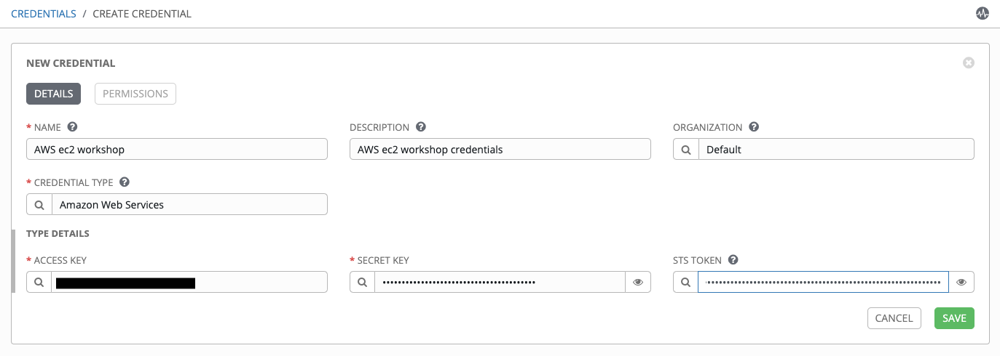
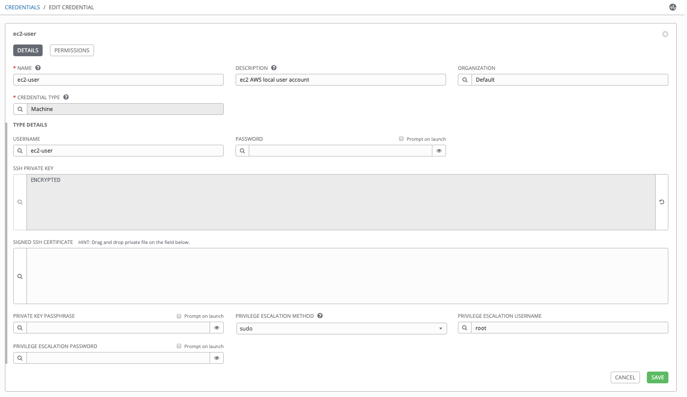
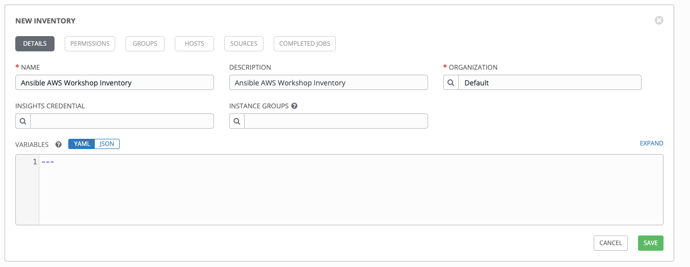
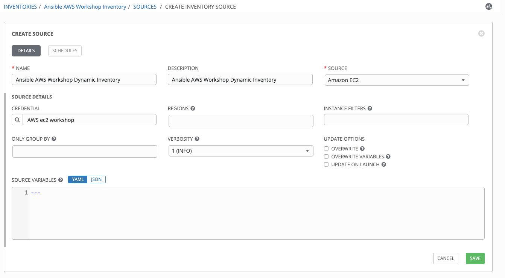
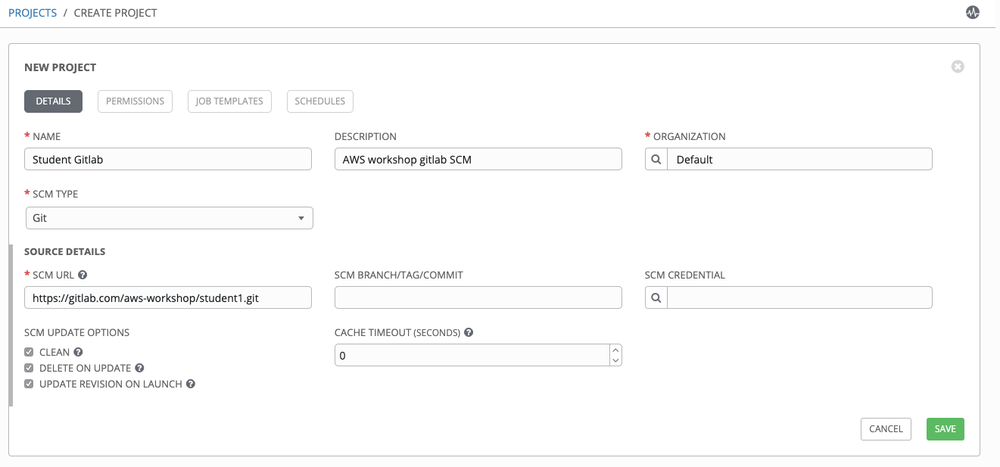

# Exercise 2 - Configuring Ansible Tower

In this exercise, we are going to configure Tower so that we can run a playbook.

## Configuring Ansible Tower

There are a number of contructs in the Ansible Tower UI that enable multi-tenancy, notifications, scheduling, etc. However, we are only going to focus on a few of the key contructs that are required for this workshop today.

* Credentials
* Projects
* Inventory
* Job Template

## Logging into Tower and Installing the License Key

### Step 1:

To log in, use the username `admin` and the admin password you set in the inventory file.


As soon as you login, you will prompted to request a license or browse for an existing license file


### Step 2:

In a separate browser tab, browse to [https://www.ansible.com/workshop-license](https://www.ansible.com/workshop-license) to request a workshop license.

### Step 3:

Back in the Tower UI, choose BROWSE  and upload your recently downloaded license file into Tower.

### Step 4:

Select "_I agree to the End User License Agreement_"

### Step 5:

Click on SUBMIT 

## Creating a Credential

Credentials are utilized by Tower for authentication when launching jobs against machines,
synchronizing with inventory sources, and importing project content from a version control system.

There are many [types of credentials](http://docs.ansible.com/ansible-tower/latest/html/userguide/credentials.html#credential-types) including machine, network, and various cloud providers.

In this workshop, we're going to setup AWS and machine credentials to demonstrate their use.

### Step 1:

Select CREDENTIALS

### Step 2:

Click on ADD 

### Step 3:

Complete the credential form using the following entries:

| FIELD | VALUE |
| :--- | :--- |
| NAME | AWS ec2 workshop |
| DESCRIPTION | AWS ec2 workshop credentials |
| ORGANIZATION | Default |
| TYPE | Amazon Web Services |
| ACCESS KEY | \<ask your instructor for details\> |
| SECRET KEY | \<ask your instructor for details\> |
| STS TOKEN | \<ask your instructor for details\> |




### Step 4:

Select SAVE 


Repeat this step creating a MACHINE credential as follows:

| FIELD | VALUE |
| :--- | :--- |
| NAME | ec2-user |
| DESCRIPTION| ec2 AWS local user account |
| ORGANIZATION| Default |
| CREDENTIAL TYPE| Machine |
| USERNAME| ec2-user |
| SSH PRIVATE KEY| \<ask your instructor for details\>
| PRIVILEGE ESCALATION METHOD | sudo |
| PRIVILEGE ESCALATION USERNAME | root |



## Creating a Dynamic Inventory

An inventory is a collection of hosts against which jobs may be launched. Inventories are divided into groups and these groups contain the actual hosts. Groups may be sourced manually, by entering host names into Tower, or from one of Ansible Tower’s supported cloud providers.

An Inventory can also be imported into Tower using the `tower-manage` command and this is how we are going to add an inventory for this workshop.

We are going to use the AWS dynamic inventory script to pull in the infrastructure we've create so far during this workshop. NOTE: that you will now see EVERYONES instances etc!

### Step 1:

Click on INVENTORIES

### Step 2:

Select ADD  and select Inventory.

### Step 3:

Complete the form using the following entries

| FIELD | VALUE |
| :--- | :--- |
| NAME | Ansible AWS Workshop Inventory |
| DESCRIPTION | Ansible AWS Workshop Inventory |
| ORGANIZATION | Default |



### Step 4:

Select SAVE 

### Step 5:

Click on SOURCES and select ADD .

### Step 6:

Complete the form using the following entries

| FIELD | VALUE |
| :--- | :--- |
| NAME | Ansible AWS Workshop Dynamic Inventory |
| DESCRIPTION | Ansible AWS Workshop Dynamic Inventory |
| SOURCE | Amazon EC2 |
| CREDENTIALS| AWS ec2 workshop |

### Step 7:

Select SAVE 

### Step 8:

Scroll down to the Ansible AWS Workshop Inventory, at the bottom of the screen and Click on SYNC ALL.

Notice the green flashing cloud symbol? Click on that and it'll take you to the JOBS dashboard where you'll see the job running and pulling in the dynamic inventory from AWS.

Go to Inventories and check out your newly discovered hosts/groups.

Optional: you can limit the inventory to just your hosts/info by using some additional filters

Try editing your Dynamic Inventory Source and applying these:

| FIELD | VALUE |
| :--- | :--- |
| REGION | EU (London) |
| INSTANCE FILTERS | tag:student=student\<your number\> (ie. student2 etc) |

Click SAVE and re-run the inventory sync and go check your hosts etc again.


## Creating a Project

A Project is a logical collection of Ansible playbooks, represented in Tower. You can manage playbooks and playbook directories by either placing them manually under the Project Base Path on your Tower server, or by placing your playbooks into a source code management (SCM) system supported by Tower, including Git, Subversion, and Mercurial.

We're going to setup and use your own personal gitlab instance as our SCM and commit our engine examples into the repo for re-use in Tower.

### Step 1:

On your control node:

```bash
cd ~/linklight/exercises/aws/ansible_engine
git init
```

This has created a new git repo. We now need to exclude a few files as we either don't need them or contain confidential information which shouldn't be in the public domain.

```bash
vi .gitignore
```

add

```bash
aws-keys.yml
1-setup
```

In fact, now delete the vault file we used before:

```bash
rm ~/linklight/exercises/aws/ansible_engine/aws_keys.yml
```

We'll make a few tweaks to the original security group playbook, as there are things in there we no longed need or Tower functionality replaces.

```bash
vi 2-securitygroup/aws_security_group.yml
```

Remove the vars_files lines near the top:

```bash
  vars_files:
    - ../aws_keys.yml
```

Also remove ALL occurences of these lines, as Tower will use the AWS credentials in its place:

```bash
        aws_access_key: "{{ aws_access_key }}"
        aws_secret_key: "{{ aws_secret_key }}"
        security_token: "{{ security_token }}"
```

Finally add in your student number variable as this was stored in the vault file, which we've removed.

Your vars section should now look like:

```bash
  vars:
    student: student2
    security_group: "{{student}}_sg"
    region: eu-west-2
    teardown: false
```

Let's make your first add and commit to the SCM base:

```bash
git config --global user.email "doesntmatter@whocares.com"
git config --global user.name "student1"
git add .gitignore
git add 2-securitygroup/aws_security_group.yml
git commit -m "Initial commit" -a
```

You should see something like:

```bash
[master (root-commit) 0a4984e] Initial commit
 2 files changed, 43 insertions(+)
 create mode 100644 .gitignore
 create mode 100644 2-securitygroup/aws_security_group.yml
```

We can now push this code to our SCM. Ask the instructor for PAT token details as you'll need them.

```bash
git remote add origin https://ffirg:<PAT Token>@gitlab.com/aws-workshop/student<number>.git
git push origin master
```

We can now add this SCM to a Project in Tower.

Click on PROJECTS

### Step 2:

Select ADD 

### Step 3:

Complete the form using the following entries

| FIELD | VALUE |
| :--- | :--- |
| NAME | Student Gitlab |
| DESCRIPTION | AWS workshop gitlab SCM |
| ORGANIZATION | Default |
| SCM TYPE | Git |
| SCM URL | https://gitlab.com/aws-workshop/student[number].git |
| SCM UPDATE OPTIONS | [x] Clean [x] Delete on Update [x] Update on Launch |




### Step 4:

Select SAVE 

Tower should kick off a Project Sync Job. A green circle against the Project will dictate that it's been successful.

---

[Click Here to return to the Ansible AWS Workshop](../../README.md)
