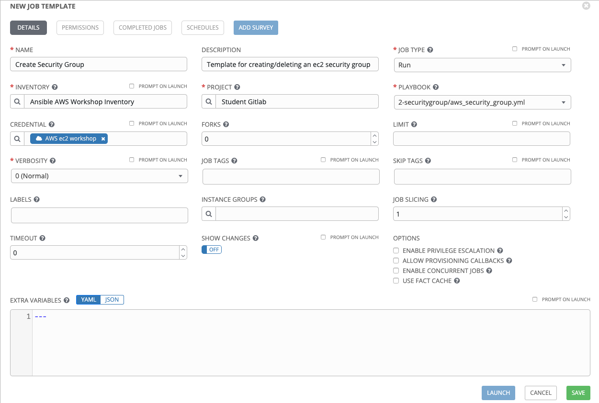
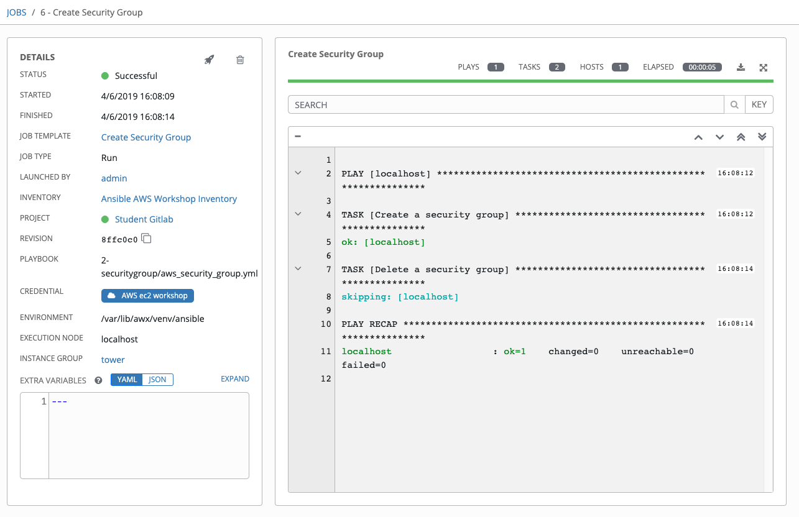
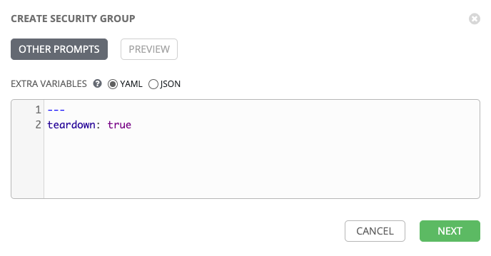
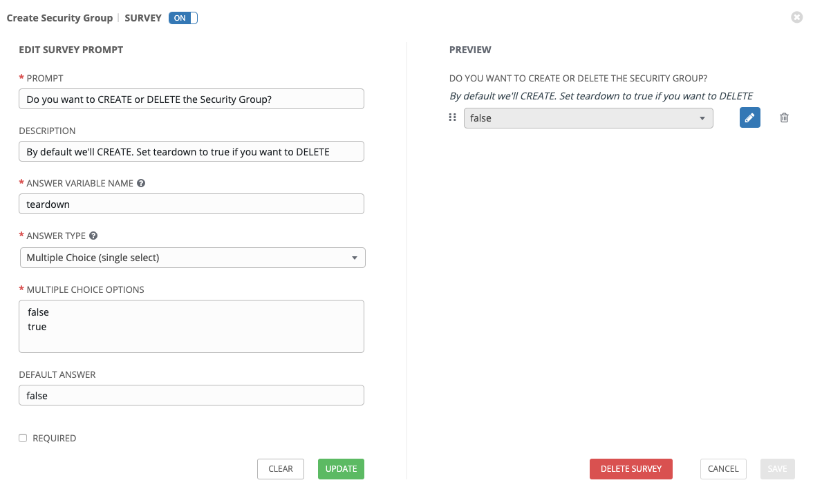

# Exercise 3 - Creating and Running a Job Template

A job template is a definition and set of parameters for running an Ansible job. Job templates are useful to execute the same job many times.


## Creating a Job Template

### Step 1:

Select TEMPLATES

### Step 2:

Click on ADD , and select JOB TEMPLATE

### Step 3:

Complete the form using the following values

| FIELD | VALUE |
| :--- | :--- |
| NAME | Create Security Group |
| DESCRIPTION | Template for creating/deleting an ec2 security group |
| JOB TYPE | Run |
| INVENTORY | Ansible AWS Workshop Inventory |
| PROJECT | student gitlab |
| PLAYBOOK | 2-securitygroup/aws_security_group.yml |
| CREDENTIAL | AWS ec2 workshop (from Amazon Web Services Credential Type) |



### Step 4:

Click SAVE 


## Running a Job Template

Now that you've sucessfully created your Job Template, you are ready to launch it.
Once you do, you will be redirected to a job screen which is refreshing in realtime
showing you the status of the job.


### Step 1:

Select TEMPLATES

---
**NOTE**
Alternatively, if you haven't navigated away from the job templates creation page, you can scroll down to see all existing job templates

---

### Step 2:

Click on the rocketship icon  for the *Create Security Group*

### Step 3:

Sit back, watch the magic happen!

One of the first things you will notice is the summary section.  This gives you details about your job such as who launched it, what playbook it's running, what the status is, i.e. pending, running, or complete.

Scrolling down, you will be able to see details on the play and each task in the playbook.

To the right, you can view standard output; the same way you could if you were running Ansible Core from the command line.




### Step 4:

Remember that we coded this playbook so it could do a deletion as well?

Change the Job Template and tick the PROMPT ON LAUNCH option to the right of EXTRA VARIABLES and SAVE it again.

Run it again, and add teardown: true under the '---' line in the prompt box:



Click Next, then Launch.

The security group will now be deleted!


### Step 5: Adding a Survey

We have a nicely coded playbook which allows us to create or delete a Security Group.

But having to add variables in at runtime isn't particularly neat and is prone to user error.

Luckily, Tower has a feature called Surveys, which allows us to do this in a much better way.

Delete the extra variable line you just added:

```bash
---
teardown: true
```

Click SAVE.

Now click on ADD SURVEY.

Add details to match this screenshot:



Now click ADD and then SAVE.

Untick PROMPT ON LAUNCH next to the EXTRA VARIABLES SECTION and click SAVE.

Launch the Job Template and test things out!


### Step 6:

NOTE: please ensure you have a security group created before you leave this exercise as it's needed for the rest of the exercises.

---

[Click Here to return to the Ansible AWS Workshop](../../README.md)
