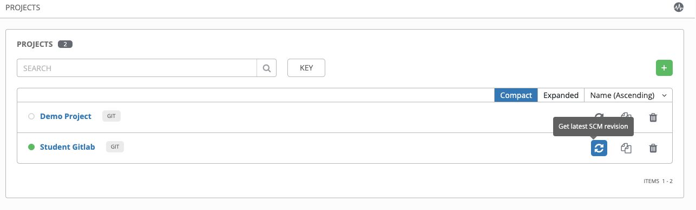

# Exercise 4 - Adding in the Other Job Templates

Let's revise, git commit and sync the rest of the playbooks we wrote so we can consume then in Tower.

## Revise the Playbooks

Let re-factor the playbooks into roles so they can share a common base and reduce duplication.

```bash
mkdir /home/student1/linklight/exercises/aws/ansible_engine/roles
cd /home/student1/linklight/exercises/aws/ansible_engine/roles
mkdir -p instances/tasks loadbalancer/tasks addservices/tasks
cp -pr ../6-ami/roles/ami .
cp -pr ../6-ami/group_vars .
```

Edit the following file:

```bash
vi groups_vars/all
```

Add your student variable in so it looks like:

```bash
student: student1
region: eu-west-2
security_group: "{{student}}_sg"
keypair: laptop
```

Now copy the original playbooks we created into the tasks folder for each role:

```bash
cp ../3-instances/aws_ec2_instances.yml instances/tasks/main.yml
cp ../4-loadbalancer/aws_ec2_elb.yml loadbalancer/tasks/main.yml
cp ../5-addservices/aws_ec2_web_servers.yml addservices/tasks/main.yml
```

Now remove/modify the redundant parts from each of the above, as follows...

Remove the lines after the first '---' down to and including the first tasks:

Also remove ALL occurences of these lines, as Tower will use the AWS credentials in its place:

```bash
        aws_access_key: "{{ aws_access_key }}"
        aws_secret_key: "{{ aws_secret_key }}"
        security_token: "{{ security_token }}"
```

You also need for remove the initial indentation, which you can do in vi using 
```bash
:%s/    //g
```
(that's 4 spaces in the above command)

We now need to create the playbooks that will call the roles just created.

```bash
cd ~/linklight/exercises/aws/ansible_engine
```

The first one is for our load balancer:

```bash
vi ec2_elb.yml
```

Add the following:

```bash
---

- name: create our load balancer for our web servers
  hosts: localhost
  connection: local
  gather_facts: false

  roles:
    - loadbalancer
```

We can create one playbook for our instances creations and web server install/config if we like by calling 2 roles in the one playbook:

```bash
vi ec2_webservers.yml
```

Add the following:

```bash
---

- name: create our ec2 instances
  hosts: localhost
  connection: local
  gather_facts: false

  roles:
    - instances
    - addservices
```

## Git Commit 

```bash
cd ..
git add roles ec2_elb.yml ec2_webservers.yml
git commit -m "More playbooks" -a
git push origin master
```

## Tower Project Sync

Go to PROJECTS in Tower , and re-sync the Student Gitlab repo



## Create Job Templates

---

[Click Here to return to the Ansible AWS Workshop](../../README.md)
