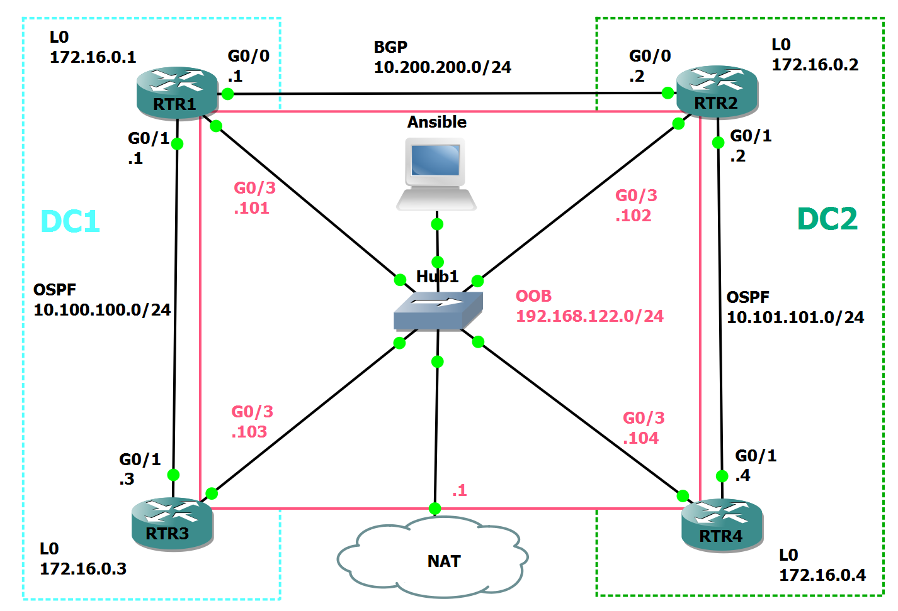

# Ansible Linklight - Networking

This content provides the ability to learn Ansible's capabilities on Cisco network routers at a self-paced speed using the free lab environment of GNS3.

## Network Diagram
### GNS3 Diagram

## Ansible Network Automation Exercises - Cisco 

### Section 01 - Using Ansible to gather data from network devices
- [Exercise 1.0 - Exploring the lab environment](./exercises/1-0-explore)
- [Exercise 1.1 - Writing your first playbook](./exercises/1-1-first-playbook)
- [Exercise 1.2 - Module documentation, Registering output & tags](./exercises/1-2-playbook-basics)

### Section 02 - Using Ansible to configure, backup and restore
- [Exercise 2.0 - Updating the router configurations using Ansible](./exercises/2-0-config)
- [Exercise 2.1 - Backing up the router configuration](./exercises/2-1-backup/)
- [Exercise 2.2 - Using Ansible to restore the backed up configuration](./exercises/2-2-restore)

### Section 03 - Reporting using Ansible to parse 
- [Exercise 3.0 - An introduction to templating with Jinja2](./exercises/3-0-templates)
- [Exercise 3.1 - Building dynamic documentation using the command parser](./exercises/3-1-parser/)
- [Exercise 3.2 - Using structured JSON output](./exercises/3-2-json/)
- [Exercise 3.3 - Interface Descriptions to text file](https://github.com/colin-mccarthy/ansible-playbooks-for-cisco-ios/blob/master/register_2_text.yml)
- [Exercise 3.4 - Evaluate VTY](https://github.com/colin-mccarthy/ansible-playbooks-for-cisco-ios/blob/master/gather_vty.yml)
- [Exercise 3.5 - Show Routing Table](https://www.reddit.com/r/networking/comments/6ljtpo/bossing_cisco_around_with_ansible/)
### Section 04 - Using Ansible to generate configs
- [Exercise 4.1 - RTR4 YAML](https://github.com/ipspace/ansible-exercises/tree/master/Jinja2/refactor-data-model)
- [Exercise 4.2 - Evaluate VTY](https://github.com/ahsec/Network_Automation-Python_Ansible/tree/master/class6)
- [Exercise 4.3 - Python and Ansible](https://github.com/ahsec/Network_Automation-Python_Ansible/tree/master/class5)
- [Exercise 4.5 - Generating A Full Router Config](http://ansible.redhatgov.io/standard/network/exercise1.4.html)
### Section 05 - Updating Cisco IOS for Common Items
- [Exercise 5.1 - Update NTP](https://github.com/ahsec/Network_Automation-Python_Ansible/tree/master/class6)
- [Exercise 5.2 - Update name-servers](https://github.com/colin-mccarthy/ansible-playbooks-for-cisco-ios/blob/master/intent_dns.yml)
- [Exercise 5.3 - Update banner](https://github.com/colin-mccarthy/ansible-playbooks-for-cisco-ios/blob/master/config_banner.yml)
- [Exercise 5.4 - Update logging](https://github.com/colin-mccarthy/ansible-playbooks-for-cisco-ios/blob/master/intent_logging.yml)
- [Exercise 5.5 - Update SNMP](https://github.com/colin-mccarthy/ansible-playbooks-for-cisco-ios/blob/master/intent_snmp.yml)
- [Exercise 5.6 -  Adding and removing user](https://github.com/colin-mccarthy/ansible-playbooks-for-cisco-ios/blob/master/remove_user.yml)
- [Exercise 5-7 - Setting a VTY ACL](https://www.reddit.com/r/networking/comments/6ljtpo/bossing_cisco_around_with_ansible/)
- [Exercise 5.8 - Disable http servers](./exercises/5-8-disablehttp)
- [Exercise 5.9 - Enable Configuration Archive](./exercises/5-9-archive)
- [Exercise 5.10 - Create DHCP pools on Cisco IOS devices](https://github.com/ipspace/ansible-examples/tree/master/DHCP-Pools)
### Section 06 - Auditing
- [Exercise 6.1 - Audit Configs](https://github.com/colin-mccarthy/ansible-playbooks-for-cisco-ios/blob/master/audit_configs/audit.yml)
- [Exercise 6.2 - Audit Configs Using Tests Folder](https://github.com/ipspace/ansible-examples/tree/master/Sample-Compliance-Check)
### Section 08 - Advanced Ansible Functions
- [Exercise 8.1 - Conditions Conditions](https://www.reddit.com/r/networking/comments/6ljtpo/bossing_cisco_around_with_ansible/)
- [Exercise 8.2 - More Conditions](https://www.linuxtechi.com/use-when-conditions-in-ansible-playbook/)
- Using WHEN to selectively apply 
- [Excercise 8.4 - Loops](https://github.com/ipspace/NetOpsWorkshop/tree/master/Ansible/Loops)

## Using Ansible with JunOS
- [https://github.com/ahsec/Network_Automation-Python_Ansible/tree/master/class10](https://github.com/ahsec/Network_Automation-Python_Ansible/tree/master/class10)
- [https://go.nrelabs.io/labs/?lessonId=41&lessonStage=1](https://go.nrelabs.io/labs/?lessonId=41&lessonStage=1)
- [https://www.ansible.com/blog/agnostic-network-automation-examples-with-ansible-and-juniper-nre-labs](https://www.ansible.com/blog/agnostic-network-automation-examples-with-ansible-and-juniper-nre-labs)

## Ansible Tower Exercises

- [Exercise X.0 - Configure Ansible Tower](./exercises/4-0-tower-setup)
- [Exercise X.1 - Create a Tower Job Template ](./exercises/4-1-tower-job-template)
- [Exercise X.2 - Create a Tower Survey ](./exercises/4-2-tower-survey)
- [Exercise X.3 - Create a Tower User Template ](./exercises/4-3-tower-user-template)
- [Exercise X.4 - Tower Workflows ](./exercises/4-4-tower-workflow)
- [Exercise X.5 - Configuration Drift ](./exercises/4-5-config-drift)
- [Exercise X.6 - Network Testing with Workflows ](./exercises/4-6-more-workflows)

## Original Linklight Diagram

## Additional information
 - [Network Automation with Ansible Homepage](https://www.ansible.com/network-automation)
 - [List of Networking Ansible Modules](http://docs.ansible.com/ansible/latest/list_of_network_modules.html)
 - [Module Maintenance & Support](http://docs.ansible.com/ansible/latest/modules_support.html)
 - [Network Automation GitHub Repo](https://github.com/network-automation)
 - [https://github.com/ipspace/NetOpsWorkshop](https://github.com/ipspace/NetOpsWorkshop)
 - [https://github.com/jamalshahverdiev/ansible-playbooks-in-practice/tree/master/cisco-playbooks/cisco-daily-using-playbook](https://github.com/jamalshahverdiev/ansible-playbooks-in-practice/tree/master/cisco-playbooks/cisco-daily-using-playbook)
 - [https://networkproguide.com/example-ansible-playbook-for-updating-cisco-ios-switches/](https://networkproguide.com/example-ansible-playbook-for-updating-cisco-ios-switches/)
 - [https://github.com/colin-mccarthy/Ansible-Playbooks-for-Cisco-IOS](https://github.com/colin-mccarthy/Ansible-Playbooks-for-Cisco-IOS)
## Additional Courses 
- [https://pynet.twb-tech.com/class-ansible.html](https://pynet.twb-tech.com/class-ansible.html)
- [https://www.networktocode.com/training/network-programming-automation/](https://www.networktocode.com/training/network-programming-automation/)
- [https://learn-networking.teachable.com/p/ansible-for-network-engineers](https://learn-networking.teachable.com/p/ansible-for-network-engineers)
- [https://github.com/ipspace/NetOpsWorkshop](https://github.com/ipspace/NetOpsWorkshop)
---

- [Red Hat® Ansible® Network Automation](https://www.ansible.com/networking): automate networking devices from Arista (EOS), Cisco (IOS, IOS XR, NX-OS), Juniper (JunOS), Open vSwitch, and VyOS and many more! Includes [Ansible Tower](https://www.ansible.com/tower) curated content specifically for network use cases.
<!--stackedit_data:
eyJoaXN0b3J5IjpbLTE0OTE4NjUzMDIsMTE3MDk1Mjk5NywxOT
kzNjI2OTUsODIxMjAxNTQyLC0xMTQ3MzY2OTQsLTIxMDc4OTY0
MTcsLTk1MjU4Mjc2NiwtMjI3Mzg5NjQ4LDE3NDc3ODM0NjEsMj
A2MTg5NDA1NiwtMTcyMDQ2NTcyNiw2NDMyMDQ3ODgsLTE4MjU3
MzIwODgsLTIxMzc0MDY1MDgsMTI2OTU1OTUyNiwtOTc2ODk2NT
cyLC0xNTI5MDU1NDI3LC0xNjEzNDgyMzE3XX0=
-->