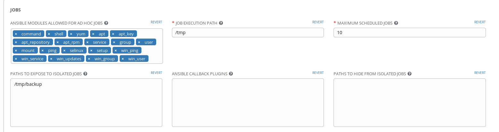
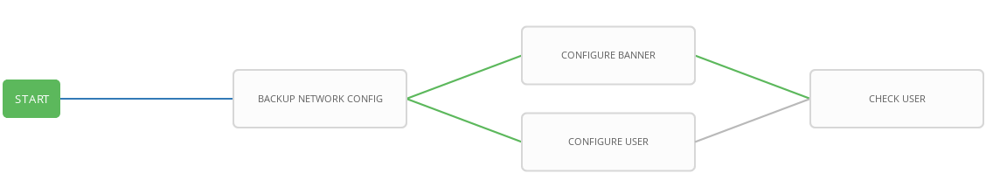

# Exercise 4-4: Creating a Workflow

## Table of Contents

- [Objective](#objective)
- [Guide](#guide)
- [Solution](#solution)

# Objective

Demonstrate the use of [Ansible Tower workflow](https://docs.ansible.com/ansible-tower/latest/html/userguide/workflows.html).  Workflows allow you to configure a sequence of disparate job templates (or workflow templates) that may or may not share inventory, playbooks, or permissions.

For this exercise we will create a backup, if the backup job successfully completes the workflow will simultaneously configure a banner and a user.  Then we are going to simulate some testing. If the testing fails then we will restore to the time stamped backup.

# Guide

## Step 1:

First we Open the web UI and click on the `Templates` link on the left menu.

Click on the green `+` button to create a new job template (make sure to select `Job Template` and not `Workflow Template`)

| Parameter | Value |
|---|---|
| Name  | CHECK USER  |
|  Job Type |  Run |
|  Inventory |  Workshop Inventory |
|  Project |  Workshop Project |
|  Playbook |  check_user.yml |
|  Credential |  Workshop Credential |

Scroll down and click the green `save` button.

## Step 2

Tower protects the local filesytem using something called bubblewrap. This is to prevent people from writing malicious playbooks that compromise the Tower node itself. For this lab we will be backing up router configs into /tmp/backup on the Tower node and restoring from there. To allow us to retrieve the backed up configs we will need to allow access to /tmp/backup while running a job.

In the Tower UI click on **Settings** in the left hand pane. Then click on **Jobs**. In the text box for **PATHS TO EXPOSE TO ISOLATED JOBS** enter **/tmp/backup**.

Then click **save**.

## Step 3

Click on the **templates** link on the left menu.  Then click on the green **+** button.  Select the **Workflow Template**.  Fill out the the form as follows:

| Parameter | Value |
|---|---|
| Name  | WORKSHOP WORKFLOW  |
|  Organization |  Default |
|  Inventory |  Workshop Inventory |

Click on the **Save** button

## Step 4

When you click the **SAVE** the **WORKFLOW VISUALIZER** should automatically open.  If not click on the blue **WORKFLOW VISUALIZER** button.  

By default only a green **START** button will appear.  Click on the **START** button.  

The **ADD A TEMPLATE** window will appear on the right.  Select the **BACKUP NETWORK CONFIG** job template that was created earlier.  Use the drop down box to select run.  Click the green **SELECT** button.

The **BACKUP NETWORK CONFIG** job template is now a node.  Job or workflow templates are linked together using a graph-like structure called nodes. These nodes can be jobs, project syncs, or inventory syncs. A template can be part of different workflows or used multiple times in the same workflow. A copy of the graph structure is saved to a workflow job when you launch the workflow.

## Step 5

Hover over the **BACKUP NETWORK CONFIG** node and click the green **+** symbol.  The **ADD A TEMPLATE** window will appear again.  This time select the **CONFIGURE BANNER** job template.  For the **Run** parameter select **On Success** from the drop down menu.

You will not be able to click **SELECT** until you pre-populate the prompt.  Just fill out the **PROMPT** with your desired banner.

A green line should exist between **BACKUP NETWORK CONFIG** and **CONFIGURE BANNER**

## Step 6

Hover over the **BACKUP NETWORK CONFIG** node (not the **CONFIGURE BANNER** node) and click the green **+** symbol.  The **ADD A TEMPLATE** will appear again.

This time select the **CONFIGURE USER** job template.  For the **Run** parameter and select **On Success** from the drop down menu.  Just like the previous step fill out the prompt or it will not let you **SELECT** the job.  Once the **SELECT** button appears green click it.

## Step 7

Hover over the **CONFIGURE BANNER** node and click the green **+** symbol.  The **ADD A TEMPLATE** will appear again.

Select the **CHECK USER** job template.  For the **Run** parameter select **On Success** from the drop down menu.  

## Step 8

Hover over the **CONFIGURE USER** node and click the blue **chain** symbol.  Now click on the existing **CHECK USER**.  A **ADD LINK** window will appear.  For the **RUN** parameter choose **On Success**.

## Step 9

Hover over the **CHECK USER** node and and click the gren **+** symbol. The **ADD A TEMPLATE** will appear again.

Select the **RESTORE NETWORK CONFIG** job template. For the **Run** parameter select **On Failure** from the drop down menu and press the select button.

Click the green **SAVE** button.

## Step 10

Return to the **templates** menu and click the rocket ship to launch the **WORKSHOP WORKFLOW** workflow template.

At any time during the workflow job you can select an individual job template by clicking on the node to see the status.

## Step 11 

The workflow should complete succesfully and the config restore job should not be called. This is because our check is looking for a user called **dodgy**.

## Step 12

Now we are going to trigger the config restore. Click on the **templates** link on the left menu. Then click the workflow visualizer next to our **WORKSHOP WORKFLOW**.

Click the **CONFIGURE USER** job within the workflow, click on **Prompt** and change the user to **dodgy**. Then click **Next**, **Confirm**, **Select** and **Save**.

Now press the **Launch** button to run the workflow again. Now we should trigger our config restore. Feel free to log onto the router while the workflow is running to confirm the **dodgy** user is created and then the restore removes the user.

# Solution
You have finished this exercise. Even though the testing was a trivial example, it shows how we can use workflows to revert configurations automatically.

You have
 - created a workflow template that creates a backup, attempts to create a user and banner for all network nodes
 - made the workflow robust, if either job template fails it will restore to the specified backup
 - launched the workflow template and explored the **VISUALIZER**

[Click here to return to the lab guide](../README.md)
